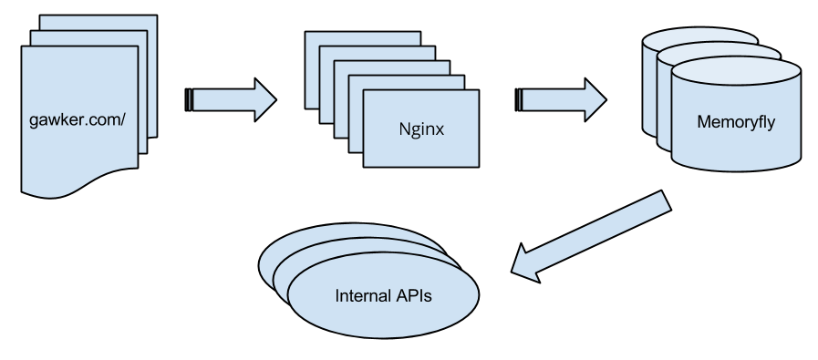

!!! note "Meta"
    These are the notes for a talk I gave at the Full Stack
    Engineering Meetup in NYC on Nov 26, 2013. You can reach me at
    wes@chartbeat.com, follow [@weschow](https://twitter.com/weschow),
    or [read random thoughts here](http://itburns.tumblr.com/). This
    talk's rendered html can be found at
    [http://wesc.github.io/talks/lua_at_cb/](http://wesc.github.io/talks/lua_at_cb/),
    or you can directly view the source files at
    [https://github.com/wesc/talks/tree/gh-pages/lua_at_cb](https://github.com/wesc/talks/tree/gh-pages/lua_at_cb).

Lua @ Chartbeat
===============

[Chartbeat](http://chartbeat.com/) provides real-time analytics and
intelligence, with a focus on the publishing world. We run on 80% of
major news sites (New York Times, Wall Street Journal, etc), and show
them insights on how users are engaging with their content, generally
with latencies measured in fraction of a second to a few seconds.

[Lua](http://www.lua.org/) is a small, fast, and easily embeddable
scripting language. It strives for simplicity, comprehensibility,
speed, and easy+efficient interfacing with C/C++ programs. These
qualities have made it popular as a scripting language for games and
embedded systems.

Lua has an official implementation maintained by the desginers at
PUC-Rio, and a second implementation by Mike Pall called
[LuaJIT](http://luajit.org/). We use LuaJIT embedded into Nginx and
Memoryfly, an in-house complex event processing system that is the
brain of Chartbeat.

Life of a Ping
--------------

When a visitor loads a page of one of our customer's pages, our
Javascript runs and starts sending us little pieces of information,
called pings, about what the user is doing.

In particular, we're interested if the user is scrolling the screen,
moving the mouse, or typing. We call this activity *engaged time*.

This results in a peak load on an average day of 140,000 pings per
second. The pings arrive on a cluster of Nginx machines, which are
configured to route them to Memoryfly shards based on
domain. Memoryfly processes the pings and provides statistics,
histograms, etc that power the [Chartbeat
dashboard](https://chartbeat.com/demo/). Internal APIs query Memoryfly
for their data.

Use Case #1: Ping Sampling
--------------------------

We aggregate then throw away the vast majority of our ping data. For
some applications, though, we need complete ping history, but keeping
around every ping is just too much data. Instead, we log a subset of
all visitors. To avoid pushing huge amounts of unnecessary data
through our system, we sample as early in the pipeline as possible,
thus in Nginx.

The [lua-nginx-module](https://github.com/chaoslawful/lua-nginx-module)
allows you to write an Nginx request handler in Lua. It interfaces via
Nginx's config stanzas:

    #!lua
    location = /test {
        content_by_lua '
            local args = ngx.req.get_uri_args()
            for key, val in pairs(args) do
                if type(val) == "table" then
                    ngx.say(key, ": ", table.concat(val, ", "))
                else
                    ngx.say(key, ": ", val)
                end
            end
        ';
    }

`lua-nginx-module` gives a set of interfacing functions to Nginx. For
example, `ngx.say` outputs text as the response body to the
client. `ngx.req` is an object that provides accessor methods for data
inside of the HTTP request.

Our sampling code, then, looks approximate like this:

    #!lua
    local function process_ping()
       local ctx = {}
       ctx.args = ngx.req.get_uri_args()
       ctx.req_time = ngx.now()
       ctx.user_agent = ngx.var.http_user_agent or ""
       ctx.remote_addr = ngx.var.remote_addr
       ctx.http_referrer = ngx.var.http_referer
       ctx.query_string = ngx.var.args
       ctx.u_key = ctx.args["u"] -- uniquely identifies a user

       local rate = 0.01
       local scale_factor = 100000
       local u_key_hash = mmh3_32(ctx.u_key, string.len(ctx.u_key)) -- 32-bit Mumurhash
       local sample_worthy = (u_key_hash % scale_factor) < (rate * scale_factor)

       if sample_worthy then
          -- build log line to be shipped elsewhere for processing
          line = build_ping_log_line(ctx)
          logging.writeln(line)
       end
    end

What is performance like? Our Nginx servers are IO bound, so in
practice the Lua code hasn't added any noticeable overhead. This code
regularly serves over 6,000 requests per second. But suppose it *did*
impact CPU use. That's an easy problem to solve -- run more Nginx
servers.

Use Case #2: Memoryfly Computation
----------------------------------

Memoryfly is a C/C++ application for processing pings as they stream
in. The development pattern for Memoryfly is traditionally:

  1. Product team says, "hey it'd be great if we could compute X."

  2. Developer works on function for X.

  3. Developer rebuilds Memoryfly.

  4. Developer tests.

  5. Repeat 2 - 4.

  6. Developer blesses code, then *deploys* new version of Memoryfly
     with X.

  7. We patiently await requisite segfault and crummy backtrace.

  8. Attach gdb to core, debug.

  9. Repeat 2 - 8 until nirvana is reached.

In other words, your typically slow and painful development cycle for
a language lacking basic privileges of human civilization like garbage
collection.

To ease the development process, we embedded LuaJIT into Memoryfly and
exposed a ping iteration mechanism to Lua, accompanied by a mechanism
to take the return from a Lua function and convert it into an HTTP
response. This is sample code for calculating mobile vs. desktop usage
for some particular domain:

    #!lua
    local desktop = 0
    local mobile = 0

    for ping in ping_iter() do
        -- the 'P' key tells us if the ping was mobile or not
        local ping_platform = ping:string_key('P')

        -- count up mobile vs desktop pings
        if ping_platform ~= 'm' then
            mobile = mobile + 1
        else
            desktop = desktop + 1
        end
    end

    return json.encode({
        mobile=mobile,
        desktop=desktop,
    })

We can upload Lua code into Memoryfly in real time, which will then
execute and return results immediately.

Pros:

  1. Lua is considerably easier and quicker to learn than C, so it
     widens the possible set of developers who can implement Memoryfly
     APIs.

  2. It's much harder to make Lua crash.

  3. Debug cycle for API development is much faster. We have a handy
     web page that allows developers to edit Lua code, submit to
     Memoryfly, and get results back.

  4. Because we iterate through all data, we can make arbitrary
     calculations. Where we previously had to specialize Memoryfly
     APIs to allow for data pivots in specific dimensions, we now
     allow our customers to arbitrarily pivot on any data.

  5. It's very fast. Almost as fast as hand written C in most cases,
     faster in some.

Cons:

  1. (caveat) Memoryfly is single threaded. To prevent buggy Lua code
     from causing a denial of service, Memoryfly times the run and
     kills it if it takes too long. Memoryfly also throttles the
     number of Lua functions it runs to make sure it doesn't
     accidentally accumulate a backlog of unprocessed pings.

  2. String manipulation in Lua is slow, so APIs that do too much of
     that see perverse performance characteristics.

  3. Lua itself is a quirky language: no integers, 1-indexed arrays,
     well, no arrays for that matter as tables are the only data
     structure.

  4. Module system isn't fully fleshed out. There are competing
     methods, and it seems like the community is figuring it out,
     however this makes developing larger programs cumbersome. Because
     we're injecting small programs into a larger system, it doesn't
     matter to us.

Performance Runs
----------------

  * [C++](path_count.cc)

  * [JS](path_count.js)

  * [Python/PyPy](path_count.py)

  * [Lua/Luajit](path_count.lua)

Wrapping Up
-----------

Lua has served us great in a very limited role.

  1. Vastly sped up development. Easy to learn, easy to embed.

  2. Given us flexibility to compute things we couldn't compute
     before.

  3. Very high performance, and it's done what we need it probably
     about as fast as if we'd done it by hand.
